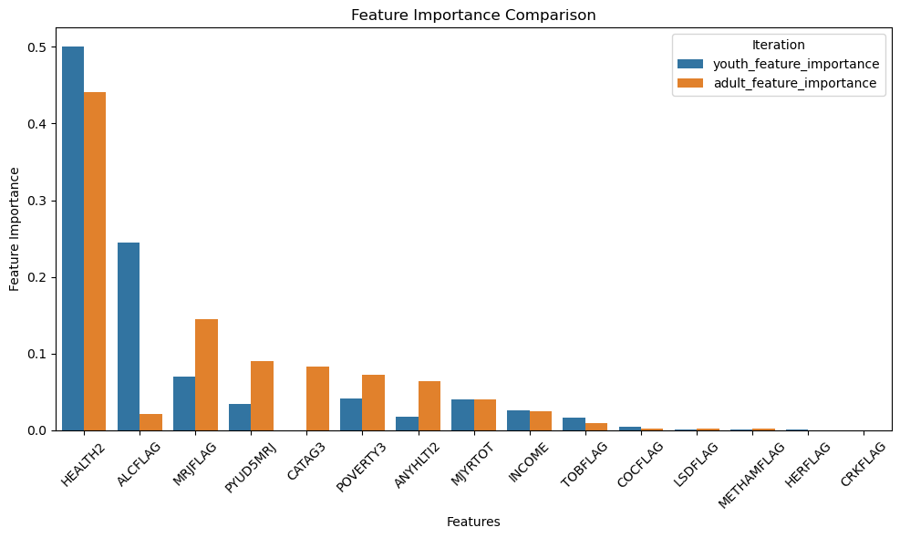

Hey Melissa and Avis! I hope both of your days went alright! I'll do a quick update so you could be on the same page :) 
Ethan, Sanja and I met for about an hour, hour and a half, not sure. We didn't work super hard, but we think we have something cool going on here!
After last night class, Ethan did some more inspection on the features importance, and found that the adult population has different features that are important for predicting depression than the youth population. Whaaat?

I would totally keep the mistery and make y'all wait to hear Ethan tell the story himself, but I'll have to give some spoilers anyway since Melissa said she's taking tomorrow off, she might want to get started before class. I won't take tomorrow off, but I am totally sure I can make it back an hour before class, so I propose we jump in the breakout room at office hours to work together, at each person's availability, of course, no pressure.

Anyway, this is what I think might be more efficient next:
* Read through this and tell me if it is at least sort of understandable
* Pull the develop branch into your branch -- might be a good idea to revise Melissa's thoughts about git on 08/09 
* You could check on what we did, see if it makes sense, and go from there.

We have to build more on this idea, but the main points to understand and highlight for the presentation are:
* We want to explore whether MJ consumption has an impact in mental health
* We took into account a variety of factors in addition MJ-related variables, like demographics and consumption of other drugs
* Our initial guess was that MJ does have an impact, but we decided to include other drugs consumption to avoid cherry-picking on MJ
* Target variable is a score that above 5 indicates depression (I'll call these POSITIVES), and under 5 is not depressive (I'll call these NEGATIVES) 
* Aim is to use ML to predict wheter someone has depression or not (their score is above 5 or under 5). Within the features of our model, which ones are more determinant? Would this features importance be different between the adult and young population, since a: the scores were collected and calculated separatedly for youngs and adults, and b: CATAG3, the category for grouping ages, is amongst the top 3 features for the entire dataset?
* Spoiler alert! --> Yes, those are different! For adults, top 3 features by order of importance are: HEALTH2, MJRFLAG (!!!), and CATAG3 (which makes me think we could try to separate the adults population as well)
* Spoiler alert! --> For youngs, top 3 features by order of importance are: HEALTH2, ALCFLAG and MJRFLAG.  

* We do have problems with class-imbalance!

Other information I know is important but not sure where to classify it anymore:
* If you want to see the step-by-step, you want to move from main.ipynb -> mainV2.ipynb -> mainV2 copy.ipynb -> mainV3_pycaret.ipynb
* Ethan did some more diggin' into ways to oversample and found a nice way that calculates values for the minority class until it matches the counts of the majority class.
* We run several models, some of them have nice accuracy, to the expense of recall
* So far, we are able to very precisely predict NEGATIVES, with LOW RATE OF FALSE POSITIVES
* FALSE NEGATIVES are about 1/4 of the total predicted NEGATIVES, which means that almost 25% of the people we predicted they don't have depression are being misclassified (and importantly, those false negatives are 6x more than the actual positives; of the total people that have depression, we only predicted less than 15%)
* Ideally we would like to improve both recall and precision. 
* We don't aim to get a perfect model, and I think we get really nice information from this humble analysis

Things we need to finish/define by tomorrow ideally:
* Maybe 3 or 4 nice viz?
* Ppt presentation
* README file 
* Some report - maybe a Tableau report with the 3/4 viz?

I might be missing something, or many things, who knows haha. Sanja and Ethan, please feel free to fill in any blanks, and to all of you, give this a thought and I will see you tomorrow! Have a good night